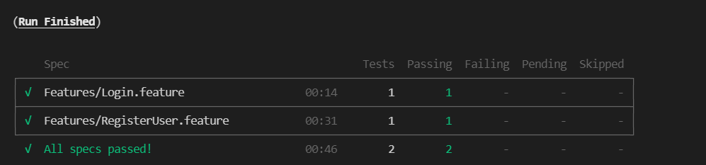
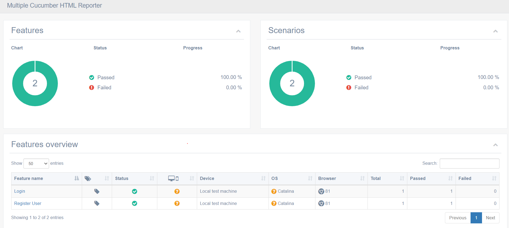

## Cypress BDD(Gherkin) E2E Test Automation Framework

## Overview
* This is E2E BDD Test Automation Framework in JavaScript is using (Cypress, cypress-cucumber-preprocessor, multiple-cucumber-html-reporter).
* **Languages:** JavaScript/Node.JS
* **Build/Dependency Management:** npm
* **Testing Frameworks:** Cypress
* **BDD Library:** cypress-cucumber-preprocessor
* **Assertion Lib:** Cypress (inbuild Chai)
* **Reporting:** multiple-cucumber-html-reporter

## Pre-requisites
* Install latest [Node.JS](https://nodejs.org/en/download/)
* Install latest [Visual Studio Code](https://code.visualstudio.com/download)
* Check access for Application Under Test [AutomationPractice](http://automationpractice.com).

## Setup Project
* Clone the source code from git as per below command.<br />
```git clone https://github.com/KunalShahare/Bizcover_PracticalExam_CypressFramework.git```
* Import the Project into Visual Studio Code 
* Open Terminal and Navigate to Project Directory
* Run `npm install` to download all the dependencies / libraries.
* Run `npm run cypress:open:local` to run the test using Cypress Runner in headed mode 
* Run `npm run cypress:run:local` to run all the test using Cypress CLI headless mode
* Run `cypress:run:generate-report` to run all the test in CLI mode and generate cucumber html report
* Run `cypress:run:tags` to execute the tests based on smart cucumber tagging
* Run `cypress:run:feature` to execute the test for a particular feature
* Run `generate-report` to generate cucumber html report independently after test execution

## Results
* CLI Results


* cypress/cucumber-json and reports folders will be created under automatically after first run.
* HTML Report Path `./reports/cucumber-html/index.html` <br />
